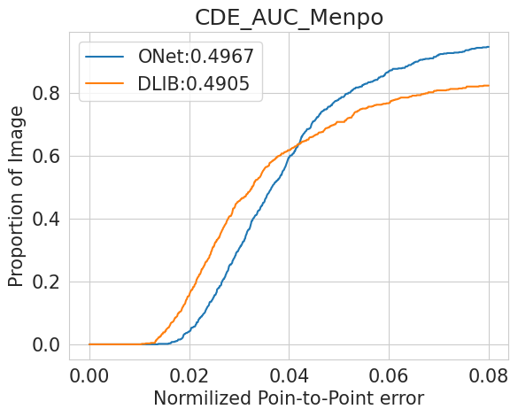

# Face Landmark Detection

Задача состоит в реализации алгоритма обнаружения 68 особых точек на лице человека (face alignment), тестировании данного алгоритма на общедоступных датасетах и сравнении с аналогами.

## Используемые датасеты:
+ 300W
+ Menpo

Целевая метрика для сравнения алгоритмов: CED
 
В качестве базового алгоритма использовалась модель детекции из библиотеки DLIB. В работе использовались две модели, результаты которых далее сравнивались с детекцией точек от DLIB.

## Модели:
+ ONet 

https://arxiv.org/pdf/1604.02878
+ DAN

https://www.researchgate.net/publication/319277818_Deep_Alignment_Network_A_Convolutional_Neural_Network_for_Robust_Face_Alignment

## Результаты

| Датасет  | DLIB |   DAN    |  ONet  |
| ---------| -----|--------- |------
| 300W     | 0.67 |   0.56   |  0.53 |      
| Menpo    | 0.50 |   0.52   |  0.50 | 

### Графики модели DAN для датасетов 300W и Menpo

 

### График модели ONet для датасетов 300W и Menpo

 

### Запуск внутри Docker

1. Запустить сборку образа с помощью `make build`
2. Запустить jupyter с помощью команды `make start`